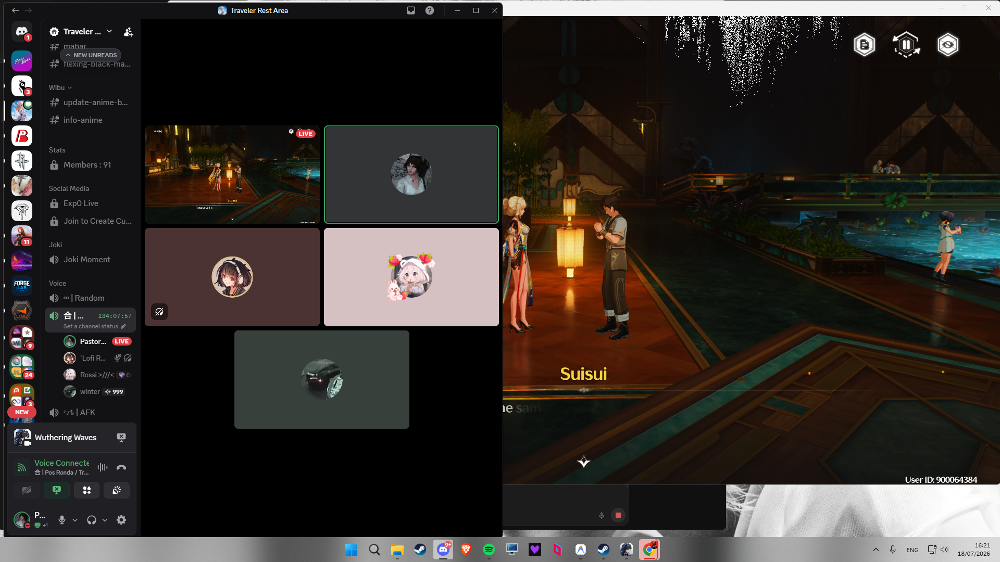
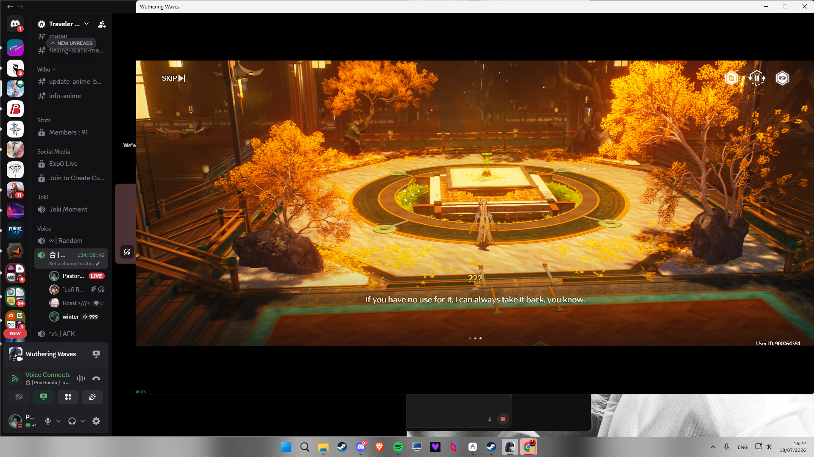
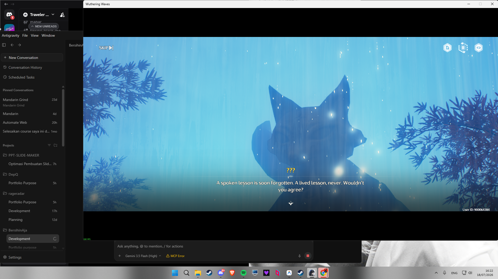
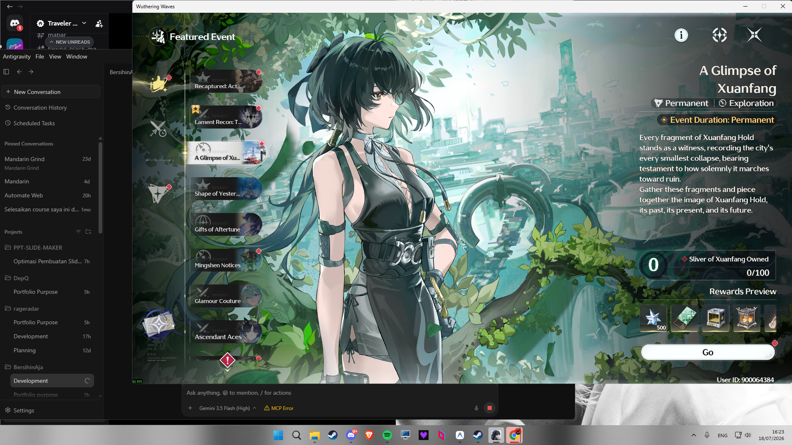
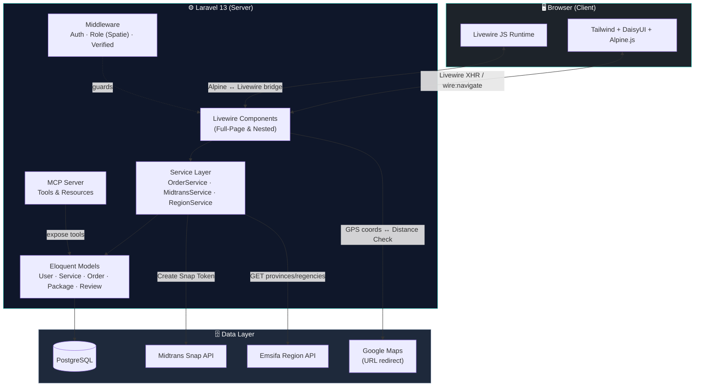
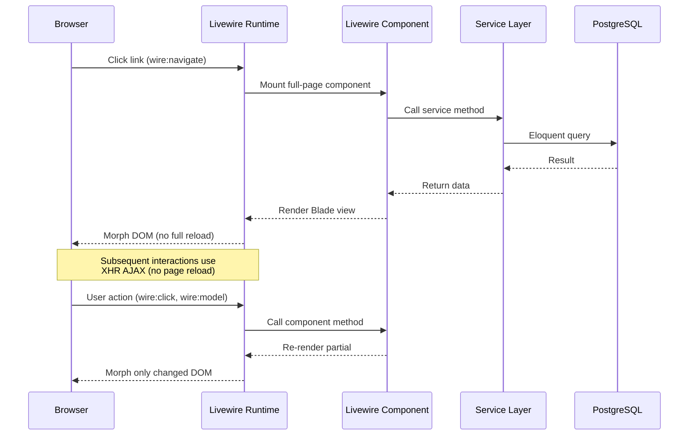
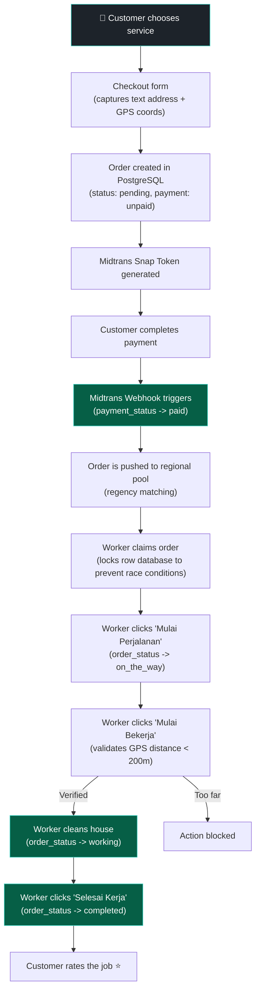
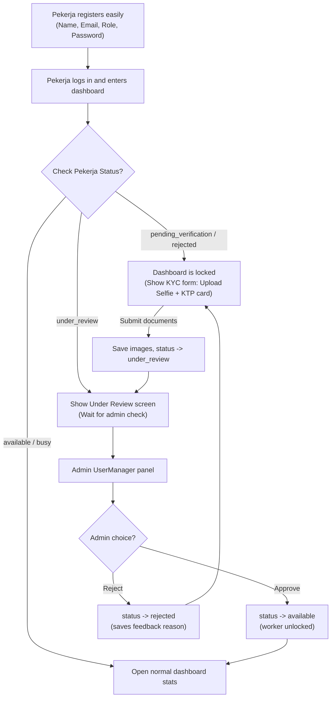
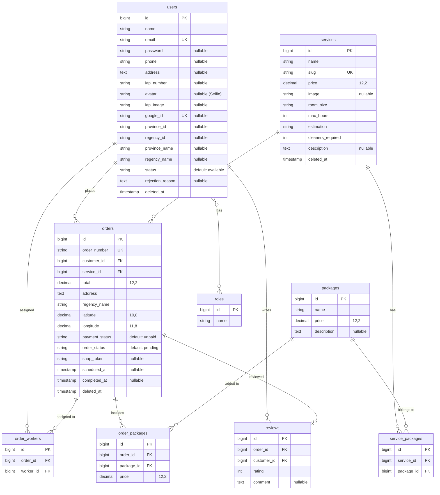

# BersihinAja — Technical Architecture Documentation

> Web-based professional home cleaning service platform.  
> Fully rewritten from CodeIgniter 3 to **Laravel 13** + **Livewire 4** + **PostgreSQL**.

---

## Table of Contents

- [System Showcase & UI Gallery](#system-showcase--ui-gallery)
- [Tech Stack](#tech-stack)
- [System Architecture](#system-architecture)
- [Request Lifecycle (Livewire SPA)](#request-lifecycle-livewire-spa)
- [Order & Payment Lifecycle](#order--payment-lifecycle)
- [Worker KYC & Verification Lifecycle](#worker-kyc--verification-lifecycle)
- [Directory Structure](#directory-structure)
- [Database Schema (ERD)](#database-schema-erd)
- [Feature Matrices per Role](#feature-matrices-per-role)
- [Route Mappings](#route-mappings)
- [Model Context Protocol (MCP) Integration](#model-context-protocol-mcp-integration)
- [Setup & Installation](#setup--installation)

---

## System Showcase & UI Gallery

Below are the key interfaces of the BersihinAja application, demonstrating multi-role capabilities, geolocation tracking, payment gateway integration, and responsive design systems.

### 1. Landing Page (First Impression)
A clean, premium modern interface showcasing available services with custom typography and real-time regional support availability checks.


### 2. Order Creation & Geolocation
Shows regional service selection, distance check computation, live GPS coordinate pin drop on the map, worker list filtering, and price estimation calculations.


### 3. Midtrans Payment Gateway Integration
Demonstrates full sandbox integration via the Midtrans Snap modal overlay. Supports secure transactions, checkout flow status hooks, and automated success redirection.


### 4. Worker Order Pool & Job Claims
Presents the regional job pool where verified cleaners can view and claim available jobs located in their specific regency (Sleman in this case).


### 5. Administrator Dashboard
A comprehensive dashboard displaying site-wide performance metrics, bento-style cards, pending/active worker KYC review workflows, and transactional histories.


---

## Tech Stack

### Backend
*   **PHP:** 8.3+
*   **Laravel Framework:** 13.x
*   **Livewire:** 4.x (Powering reactive single-page updates without page reloads)
*   **Spatie Laravel Permission:** 8.x (Role-based access control: `admin`, `pelanggan`, `pekerja`)
*   **Laravel Socialite:** 5.x (Google OAuth authentication)
*   **Midtrans PHP SDK:** 2.x (Core payment gateway integration)
*   **Laravel MCP:** 0.8.x (Model Context Protocol server)

### Frontend
*   **Tailwind CSS:** 3.x
*   **DaisyUI:** 5.x
*   **Alpine.js:** 3.x (Lightweight inline state, GPS capture, drawer states)
*   **Vite:** 8.x (Asset bundling and Hot Module Replacement)
*   **Iconify:** for premium Lucide vector icon styling

### Database & External Services
*   **PostgreSQL:** Relational database storage
*   **Emsifa API:** Third-party Indonesian administrative boundary REST API
*   **HTML5 Geolocation API:** Native browser API for worker and customer GPS capture
*   **Google Maps URL Scheme:** Direct redirection for worker navigation

---

## System Architecture



---

## Request Lifecycle (Livewire SPA)

Every page operates as a **Livewire Full-Page Component** loaded with `wire:navigate`. This achieves a complete Single Page Application (SPA) feel.



---

## Order & Payment Lifecycle

Our matching mechanism follows a regional pool design with a geofenced completion loop:



---

## Worker KYC & Verification Lifecycle

To minimize registration drop-off while securing quality, workers undergo a post-login verification loop:



---

## Database Schema (ERD)



---

## Directory Structure

```
BersihinAja/
├── app/
│   ├── Http/Controllers/
│   │   ├── Api/RegionController.php
│   │   ├── Auth/SocialiteController.php
│   │   └── PaymentController.php
│   │
│   ├── Livewire/                              # All views rendered as SPA
│   │   ├── Admin/
│   │   │   ├── Dashboard.php
│   │   │   ├── OrderManager.php
│   │   │   ├── ServiceManager.php
│   │   │   └── UserManager.php                # KYC Approvals & Rejections
│   │   ├── Auth/
│   │   │   ├── Login.php
│   │   │   └── Register.php                   # Fast sign-up (no KYC here)
│   │   ├── Forms/
│   │   │   └── OrderForm.php
│   │   ├── Orders/
│   │   │   ├── CreateOrder.php
│   │   │   ├── OrderConfirm.php
│   │   │   ├── OrderHistory.php               # Dynamic worker rating display
│   │   │   └── OrderReceipt.php
│   │   ├── Pekerja/
│   │   │   ├── CustomerList.php
│   │   │   ├── Dashboard.php                  # Post-login KYC Submission Form
│   │   │   └── OrderList.php                  # Claim Pool & GPS geofencing
│   │   ├── Profile/
│   │   │   └── ProfileEdit.php
│   │   ├── HomePage.php
│   │   ├── ServiceList.php
│   │   └── ServiceDetail.php
│   │
│   ├── Mcp/Servers/
│   │   └── BersihinAjaServer.php
│   │
│   ├── Models/
│   │   └── User.php                           # dynamic rating scopes
│   │
│   └── Services/
│       ├── MidtransService.php
│       ├── OrderService.php
│       └── RegionService.php
```

---

## Feature Matrices per Role

### 👤 Customer (Pelanggan)
*   Register & Login (Standard credentials or Google login).
*   Browse cleaning services and add-on packages.
*   Checkout with HTML5 Geolocation capture.
*   Secure payments via Midtrans.
*   Review assigned worker credentials, profile picture, and dynamic rating scores.
*   Write ulasan (reviews & ratings).

### 🛡️ Admin
*   Dashboard statistics (revenue, total orders, users).
*   Manage cleaning services (CRUD & file upload).
*   UserManager (Approve/Reject worker KYC files with feedback reason).
*   OrderManager (Assign backups, update parameters).

### 🧹 Worker (Pekerja)
*   KYC verification form (uploads Selfie, KTP image, WA, working region).
*   Rejection feedback handler (see rejection reason, re-upload documents).
*   View regional job pool and claim orders (safely locked from race conditions).
*   Step-by-step order tracking with GPS radius verification (< 200m to begin job).

---

## Route Mappings

### Public Routes
*   `GET /` → `HomePage`
*   `GET /services` → `ServiceList`
*   `GET /services/{slug}` → `ServiceDetail`

### Auth (Customer)
*   `GET /orders/create/{slug}` → `Orders\CreateOrder`
*   `GET /orders/{id}/confirm` → `Orders\OrderConfirm`
*   `GET /orders/{id}/receipt` → `Orders\OrderReceipt`
*   `GET /orders/history` → `Orders\OrderHistory`
*   `GET /profile` → `Profile\ProfileEdit`

### Auth (Admin)
*   `GET /admin/dashboard` → `Admin\Dashboard`
*   `GET /admin/services` → `Admin\ServiceManager`
*   `GET /admin/orders` → `Admin\OrderManager`
*   `GET /admin/users` → `Admin\UserManager`

### Auth (Pekerja)
*   `GET /pekerja/dashboard` → `Pekerja\Dashboard`
*   `GET /pekerja/orders` → `Pekerja\OrderList`
*   `GET /pekerja/customers` → `Pekerja\CustomerList`

---

## Model Context Protocol (MCP) Integration

BersihinAja exposes dynamic data interfaces via an MCP server endpoint at `ANY /mcp/bersihinaja`.

### Provided Tools
*   `ListServicesTool`: Exposes available catalog list.
*   `GetOrderStatusTool`: Queries real-time transaction updates.
*   `CreateOrderTool`: Prompts dynamic bookings.
*   `ListAvailableWorkersTool`: Checks regional worker counts.

---

## Setup & Installation

Detailed local setup and build instructions are outlined in the root [README.md](../README.md).
