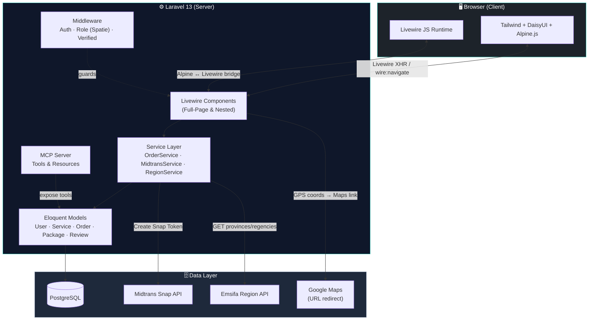
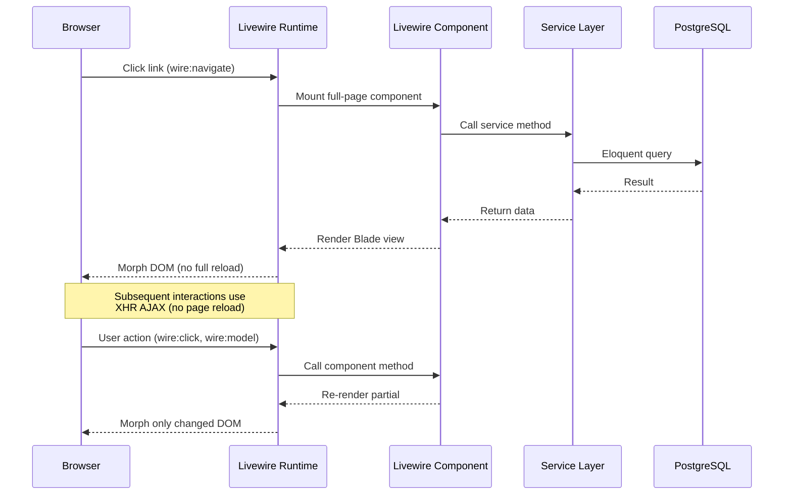
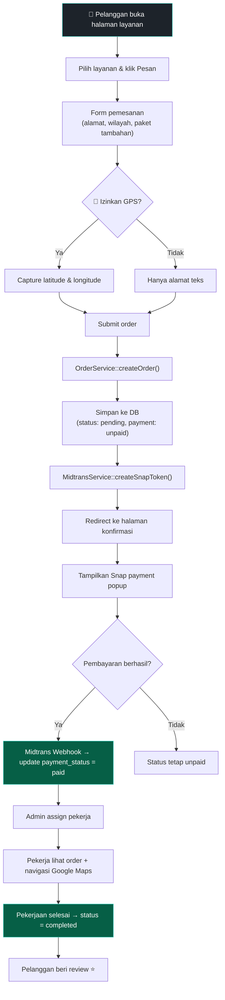
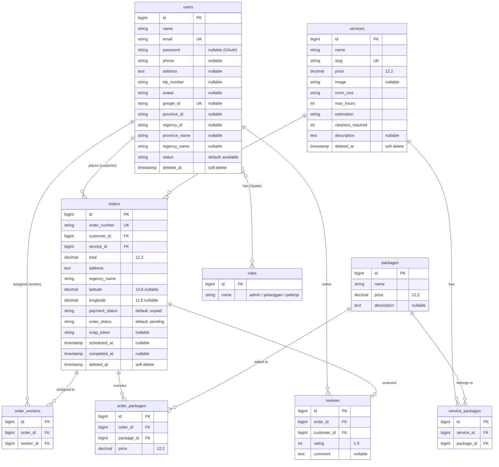
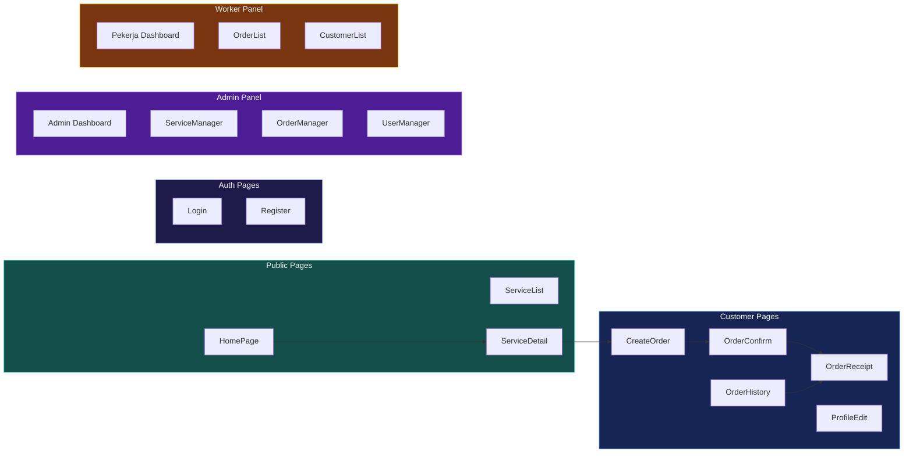
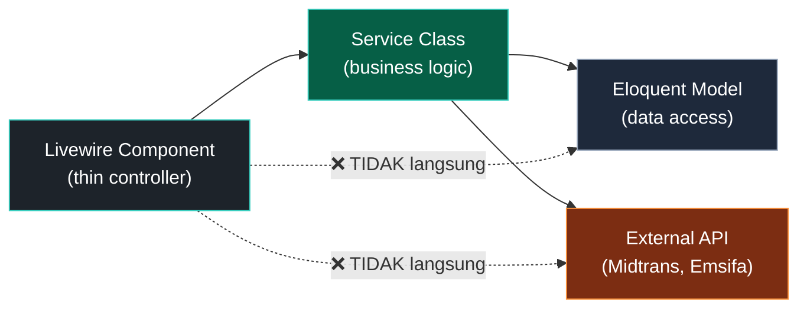
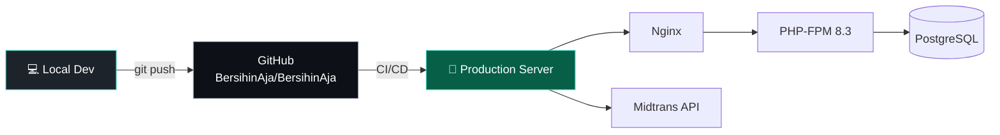

# BersihinAja — Dokumentasi Teknis

> Platform jasa kebersihan rumah profesional berbasis web.  
> Ditulis ulang sepenuhnya dari CodeIgniter 3 ke **Laravel 13** + **Livewire 4** + **PostgreSQL**.

---

## Daftar Isi

- [Tech Stack](#tech-stack)
- [Arsitektur Sistem](#arsitektur-sistem)
- [Alur Request (Livewire SPA)](#alur-request-livewire-spa)
- [Alur Pemesanan & Pembayaran](#alur-pemesanan--pembayaran)
- [Struktur Direktori](#struktur-direktori)
- [Database Schema (ERD)](#database-schema-erd)
- [Fitur per Role](#fitur-per-role)
- [Daftar Route](#daftar-route)
- [Livewire Components](#livewire-components)
- [Service Layer](#service-layer)
- [Laravel MCP Server](#laravel-mcp-server)
- [Setup & Instalasi](#setup--instalasi)
- [Environment Variables](#environment-variables)
- [Deployment](#deployment)
- [Kredit](#kredit)

---

## Tech Stack

### Backend

| Teknologi | Versi | Fungsi |
|---|---|---|
| PHP | 8.3+ | Runtime |
| Laravel | 13.x | Framework utama |
| Livewire | 4.x | Full-page SPA components (zero JS reload) |
| Spatie Permission | 8.x | Role-based access control (admin, pelanggan, pekerja) |
| Laravel Socialite | 5.x | OAuth — Google Login |
| Midtrans PHP | 2.x | Payment gateway (Snap token) |
| Laravel MCP | 0.8.x | Model Context Protocol server untuk integrasi AI |

### Frontend

| Teknologi | Versi | Fungsi |
|---|---|---|
| Tailwind CSS | 3.x | Utility-first CSS framework |
| DaisyUI | 5.x | Component library di atas Tailwind |
| Alpine.js | 3.x | Lightweight JS interactivity (dropdown, GPS, dll) |
| Vite | 8.x | Build tool & HMR dev server |
| Iconify | latest | Icon library (Lucide icon set) |

### Database & Infra

| Teknologi | Fungsi |
|---|---|
| PostgreSQL | Database utama (relational) |
| Emsifa API | Data provinsi & kabupaten Indonesia (REST) |
| HTML5 Geolocation | Capture koordinat GPS pelanggan di browser |
| Google Maps URL Scheme | Navigasi pekerja ke lokasi pelanggan |

---

## Arsitektur Sistem



---

## Alur Request (Livewire SPA)

Seluruh halaman menggunakan **Livewire Full-Page Components** dengan `wire:navigate` sehingga navigasi antar halaman terasa seperti SPA tanpa full page reload.



---

## Alur Pemesanan & Pembayaran



---

## Struktur Direktori

```
BersihinAja/
├── app/
│   ├── Http/
│   │   └── Controllers/
│   │       ├── Api/
│   │       │   └── RegionController.php      # REST API provinsi & kabupaten
│   │       ├── Auth/
│   │       │   ├── SocialiteController.php    # Google OAuth
│   │       │   └── ...                        # Breeze auth controllers
│   │       └── PaymentController.php          # Midtrans webhook handler
│   │
│   ├── Livewire/                              # 🔥 Seluruh halaman = Livewire component
│   │   ├── Admin/
│   │   │   ├── Dashboard.php                  # Statistik admin
│   │   │   ├── OrderManager.php               # CRUD & assign pekerja
│   │   │   ├── ServiceManager.php             # CRUD layanan + upload gambar
│   │   │   └── UserManager.php                # Kelola user & role
│   │   ├── Auth/
│   │   │   ├── Login.php                      # Halaman login
│   │   │   └── Register.php                   # Halaman register
│   │   ├── Forms/
│   │   │   └── OrderForm.php                  # Livewire Form Object (validasi)
│   │   ├── Orders/
│   │   │   ├── CreateOrder.php                # Form pemesanan + GPS
│   │   │   ├── OrderConfirm.php               # Konfirmasi & Snap payment
│   │   │   ├── OrderHistory.php               # Riwayat pesanan pelanggan
│   │   │   └── OrderReceipt.php               # Bukti pembayaran
│   │   ├── Pekerja/
│   │   │   ├── CustomerList.php               # Daftar pelanggan per wilayah
│   │   │   ├── Dashboard.php                  # Statistik pekerja
│   │   │   └── OrderList.php                  # Order + link Google Maps
│   │   ├── Profile/
│   │   │   └── ProfileEdit.php                # Edit profil + wilayah
│   │   ├── HomePage.php                       # Landing page
│   │   ├── ServiceList.php                    # Katalog layanan
│   │   └── ServiceDetail.php                  # Detail layanan + paket
│   │
│   ├── Mcp/
│   │   └── Servers/
│   │       └── BersihinAjaServer.php          # Laravel MCP server
│   │
│   ├── Models/
│   │   ├── User.php                           # + Google OAuth, roles, wilayah
│   │   ├── Service.php                        # Layanan kebersihan
│   │   ├── Order.php                          # Pesanan + koordinat GPS
│   │   ├── Package.php                        # Paket tambahan
│   │   └── Review.php                         # Ulasan pelanggan
│   │
│   ├── Policies/
│   │   └── OrderPolicy.php                    # Authorization rules
│   │
│   └── Services/                              # 🧩 Business logic layer
│       ├── MidtransService.php                # Snap token & config
│       ├── OrderService.php                   # Create order, assign worker
│       └── RegionService.php                  # Fetch provinsi/kabupaten
│
├── database/
│   ├── migrations/                            # 12 migration files
│   │   ├── create_users_table                 # + phone, KTP, Google ID, wilayah
│   │   ├── create_permission_tables           # Spatie roles & permissions
│   │   ├── create_services_table
│   │   ├── create_packages_table
│   │   ├── create_service_packages_table      # Pivot: service ↔ package
│   │   ├── create_orders_table
│   │   ├── create_order_workers_table         # Pivot: order ↔ pekerja
│   │   ├── create_order_packages_table        # Pivot: order ↔ paket tambahan
│   │   ├── create_reviews_table
│   │   └── add_coordinates_to_orders_table    # latitude & longitude (GPS)
│   └── seeders/
│       ├── RoleSeeder.php                     # admin, pelanggan, pekerja
│       ├── ServiceSeeder.php                  # Data layanan awal
│       ├── PackageSeeder.php                  # Data paket tambahan
│       └── AdminUserSeeder.php                # Akun admin default
│
├── resources/views/
│   ├── components/                            # Blade components (layout, nav)
│   ├── livewire/                              # Blade views untuk Livewire
│   │   ├── admin/                             # Views admin panel
│   │   ├── auth/                              # Views login & register
│   │   ├── orders/                            # Views pemesanan
│   │   ├── pekerja/                           # Views panel pekerja
│   │   └── profile/                           # Views profil
│   └── errors/                                # Custom 404, 403, 500 pages
│
├── routes/
│   ├── web.php                                # Route utama
│   ├── auth.php                               # Route autentikasi (Breeze)
│   └── ai.php                                 # Route MCP server
│
├── config/
│   └── midtrans.php                           # Konfigurasi Midtrans
│
└── public/
    ├── images/                                # Logo, favicon, assets statis
    └── build/                                 # Compiled Vite output
```

---

## Database Schema (ERD)



---

## Fitur per Role

### 👤 Pelanggan (Customer)
- Registrasi & login (email/password + Google OAuth)
- Jelajahi katalog layanan
- Pesan layanan + pilih paket tambahan
- Capture koordinat GPS saat checkout
- Bayar via Midtrans (GoPay, OVO, BCA VA, dll)
- Lihat riwayat pesanan & bukti pembayaran
- Beri review & rating
- Edit profil & pilih wilayah

### 🛡️ Admin
- Dashboard statistik (total order, revenue, user)
- Kelola layanan (CRUD + upload gambar)
- Kelola pesanan & assign pekerja
- Kelola user & role
- Lihat lokasi pelanggan di Google Maps

### 🧹 Pekerja (Worker)
- Dashboard statistik pribadi
- Lihat daftar order yang di-assign
- Navigasi ke lokasi pelanggan via Google Maps (GPS / alamat)
- Lihat daftar pelanggan per wilayah

---

## Daftar Route

### Public
| Method | URI | Komponen |
|---|---|---|
| GET | `/` | `HomePage` |
| GET | `/services` | `ServiceList` |
| GET | `/services/{slug}` | `ServiceDetail` |
| GET | `/login` | `Auth\Login` |
| GET | `/register` | `Auth\Register` |

### Authenticated (Pelanggan)
| Method | URI | Komponen |
|---|---|---|
| GET | `/orders/create/{slug}` | `Orders\CreateOrder` |
| GET | `/orders/history` | `Orders\OrderHistory` |
| GET | `/orders/{id}/confirm` | `Orders\OrderConfirm` |
| GET | `/orders/{id}/receipt` | `Orders\OrderReceipt` |
| GET | `/profile` | `Profile\ProfileEdit` |

### Admin
| Method | URI | Komponen |
|---|---|---|
| GET | `/admin/dashboard` | `Admin\Dashboard` |
| GET | `/admin/services` | `Admin\ServiceManager` |
| GET | `/admin/orders` | `Admin\OrderManager` |
| GET | `/admin/users` | `Admin\UserManager` |

### Pekerja
| Method | URI | Komponen |
|---|---|---|
| GET | `/pekerja/dashboard` | `Pekerja\Dashboard` |
| GET | `/pekerja/orders` | `Pekerja\OrderList` |
| GET | `/pekerja/customers` | `Pekerja\CustomerList` |

### API & Webhooks
| Method | URI | Controller |
|---|---|---|
| GET | `/api/regions/provinces` | `RegionController@provinces` |
| GET | `/api/regions/regencies/{id}` | `RegionController@regencies` |
| POST | `/midtrans/webhook` | `PaymentController@handleWebhook` |
| GET | `/auth/google` | `SocialiteController@redirect` |
| GET | `/auth/google/callback` | `SocialiteController@callback` |
| ANY | `/mcp/bersihinaja` | Laravel MCP Server |

---

## Livewire Components

Semua halaman menggunakan **Full-Page Livewire Components** (bukan Blade controller-based views).



---

## Service Layer

Logika bisnis dipisahkan dari Livewire component ke dalam **Service classes**:

| Service | Fungsi |
|---|---|
| `OrderService` | Membuat order, generate nomor order, menghitung total, assign pekerja |
| `MidtransService` | Membuat Snap token untuk payment gateway Midtrans |
| `RegionService` | Fetch data provinsi & kabupaten dari Emsifa API |

### Kenapa Service Layer?



> Livewire component hanya bertanggung jawab atas **UI state** dan **user interaction**.  
> Semua business logic ada di Service layer → lebih mudah di-test dan di-reuse.

---

## Laravel MCP Server

BersihinAja menyediakan **Model Context Protocol (MCP)** server agar bisa diintegrasikan dengan AI agent.

**Endpoint:** `GET/POST /mcp/bersihinaja`

### Tools
| Tool | Fungsi |
|---|---|
| `ListServicesTool` | Menampilkan daftar layanan yang tersedia |
| `GetOrderStatusTool` | Cek status pesanan berdasarkan nomor order |
| `CreateOrderTool` | Membuat pesanan baru via AI |
| `ListAvailableWorkersTool` | Daftar pekerja yang tersedia per wilayah |
| `GetOrderHistoryTool` | Riwayat pesanan user |

### Resources
| Resource | Fungsi |
|---|---|
| `ServiceCatalogResource` | Expose katalog layanan |
| `PricingGuideResource` | Expose informasi harga |

---

## Setup & Instalasi

### Prerequisites
- PHP 8.3+
- Composer 2.x
- Node.js 20+ & npm
- PostgreSQL 15+

### Quick Start

```bash
# 1. Clone repository
git clone https://github.com/BersihinAja/BersihinAja.git
cd BersihinAja

# 2. Install dependencies
composer install
npm install

# 3. Setup environment
cp .env.example .env
php artisan key:generate

# 4. Konfigurasi database (edit .env)
#    DB_CONNECTION=pgsql
#    DB_DATABASE=bersihinaja
#    DB_USERNAME=postgres
#    DB_PASSWORD=your_password

# 5. Jalankan migrasi & seeder
php artisan migrate --seed

# 6. Link storage
php artisan storage:link

# 7. Build frontend
npm run build

# 8. Jalankan development server
composer dev
# Atau manual:
# php artisan serve    (terminal 1)
# npm run dev          (terminal 2)
```

### Default Admin Account
| Field | Value |
|---|---|
| Email | `admin@bersihinaja.com` |
| Password | `password` |

---

## Environment Variables

| Variable | Deskripsi | Contoh |
|---|---|---|
| `DB_CONNECTION` | Driver database | `pgsql` |
| `DB_DATABASE` | Nama database | `bersihinaja` |
| `MIDTRANS_SERVER_KEY` | Server key Midtrans | `SB-Mid-server-xxx` |
| `MIDTRANS_CLIENT_KEY` | Client key Midtrans | `SB-Mid-client-xxx` |
| `MIDTRANS_IS_PRODUCTION` | Mode production | `false` |
| `GOOGLE_CLIENT_ID` | Google OAuth client ID | `xxx.apps.googleusercontent.com` |
| `GOOGLE_CLIENT_SECRET` | Google OAuth client secret | `GOCSPX-xxx` |
| `GOOGLE_REDIRECT_URI` | Callback URL Google | `http://localhost:8000/auth/google/callback` |

---

## Deployment



### Production Checklist
- [ ] Set `APP_ENV=production` dan `APP_DEBUG=false`
- [ ] Set `MIDTRANS_IS_PRODUCTION=true` dengan production keys
- [ ] Konfigurasi Google OAuth dengan production redirect URI
- [ ] Jalankan `php artisan config:cache && php artisan route:cache && php artisan view:cache`
- [ ] Setup SSL/HTTPS
- [ ] Konfigurasi queue worker untuk background jobs
- [ ] Setup backup database berkala

---

## Kredit

Proyek ini bermula sebagai tugas kelompok kuliah dan memenangkan kompetisi.  
Ditulis ulang sepenuhnya menggunakan teknologi modern.

**Repository asli:** [kayrinth/BersihinAja](https://github.com/kayrinth/BersihinAja) (CodeIgniter 3)  
**Rewrite oleh:** Tim BersihinAja — Laravel 13, Livewire 4, PostgreSQL

---

<p align="center">
  <strong>BersihinAja</strong> — Bersih Itu Mudah 🧹✨
</p>
